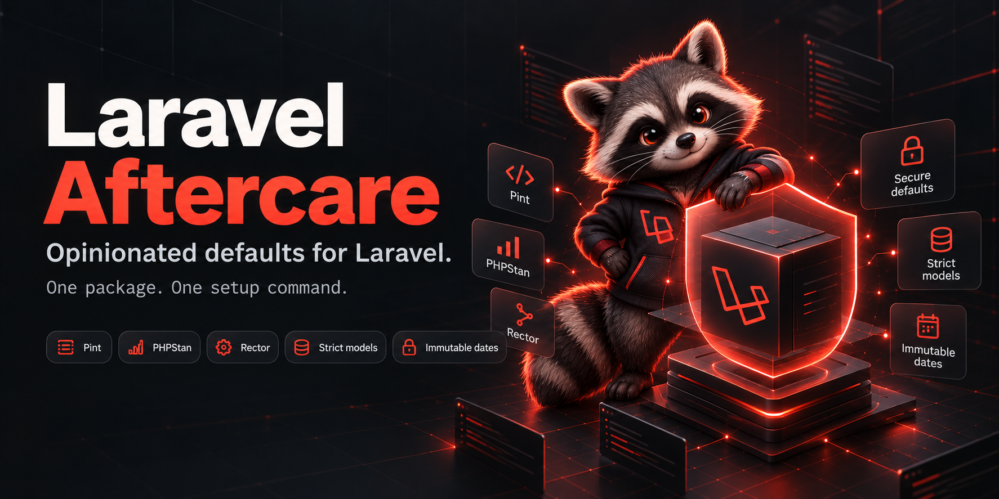

# Laravel Aftercare
**An opinionated starting configuration for Laravel.**

<p align="center">
  <a href="https://github.com/maiobarbero/laravel-aftercare/"></a>
  <a href="https://packagist.org/packages/maiobarbero/laravel-aftercare"></a>
  <a href="https://packagist.org/packages/maiobarbero/laravel-aftercare"></a>
  <a href="https://packagist.org/packages/maiobarbero/laravel-aftercare"></a>
</p>

After `laravel new`, I usually repeat the same setup: Pint, Rector, PHPStan, a password policy, and a few defaults for models, dates, and production. Laravel Aftercare brings those choices into one package and one setup command.

These are the defaults I want for my projects. The configuration and stubs are publishable, so you can change them to fit yours.

## Installation

Requires PHP 8.3+ and Laravel 12.8+ or 13.x. Run these commands inside your Laravel application:

```bash
composer require maio-barbero/laravel-aftercare
php artisan aftercare:install
```

Aftercare is a regular dependency because it applies application defaults at runtime, including in production. The setup command installs Pint, PHPStan with Larastan, and Rector as **development dependencies**.

Laravel discovers the service provider automatically. The application defaults become active as soon as the package is installed, even before you run `aftercare:install`.

The setup command runs the three tool installers, then publishes the configuration and stubs:

| File | Purpose |
| --- | --- |
| `pint.json` | Formatting rules based on Laravel's preset |
| `phpstan.neon` | Static analysis at level 8, with Larastan and Carbon support |
| `rector.php` | PHP modernization and refactoring rules |
| `config/aftercare.php` | Application defaults, with a short explanation for each setting |
| `stubs/aftercare/` | Editable templates for tool configuration and generated actions |

Setup checks for existing configuration before running Composer or publishing files. If it finds any, it stops. Use the individual commands below to install only what you need, or explicitly replace the configuration:

```bash
php artisan aftercare:install --force
# Short form:
php artisan aftercare:install -f
```

`--force` replaces the three tool configurations and `config/aftercare.php`. It preserves your published stubs and uses them when generating the tool configurations. Existing PHPStan distribution files remain in place; the generated `phpstan.neon` takes priority.

If a tool installation fails, setup stops. Completed steps remain in place. Fix the reported error and run the remaining installers, then publish the resources with `php artisan vendor:publish --tag=aftercare`.

## Application defaults

Settings are applied after application providers have booted, for both web requests and Artisan commands. Each setting can be disabled in `config/aftercare.php`; disabling it leaves that behavior under your application's control.

| Setting | Default behavior |
| --- | --- |
| Automatic eager loading | Batch-load accessed relationships to reduce N+1 queries. Explicit eager loading is still useful when you know which relationships you need. |
| HTTPS | Generate HTTPS URLs in production. TLS and proxy configuration still belong to your deployment. |
| Immutable dates | Use `CarbonImmutable` through Laravel's date factory. |
| HTTP requests | Block unfaked requests made through Laravel's HTTP client in the `testing` environment. |
| Destructive commands | Prohibit `db:wipe`, `migrate:fresh`, `migrate:refresh`, `migrate:reset`, and `migrate:rollback` in production, including with `--force`. |
| Strict models | Enable Laravel's checks for lazy loading, silently discarded attributes, and missing attributes in every environment. |
| Passwords | Require at least 12 characters, uppercase and lowercase letters, numbers, and symbols. |

Use the shared password rule in your validation:

```php
use Illuminate\Validation\Rules\Password;

return [
    'password' => ['required', 'confirmed', Password::defaults()],
];
```

The policy is editable under `password_defaults`. It applies wherever you use `Password::defaults()`; existing validation rules are not rewritten.

To publish only the application configuration:

```bash
php artisan vendor:publish --tag=aftercare-config
```

If your application has cached configuration, clear it after changing settings with `php artisan config:clear`, then rebuild the cache during deployment as usual.

## Pint, PHPStan, and Rector

Each tool has its own installer, so you can use them separately:

```bash
php artisan aftercare:pint
php artisan aftercare:phpstan
php artisan aftercare:rector
```

Each command installs its dependencies through Composer, then copies its configuration from a stub. Existing configuration is preserved unless you pass `--force` or `-f`. PHPStan also checks for `phpstan.neon.dist` and `phpstan.dist.neon`. If Composer fails, that tool's configuration is left unchanged.

**Pint** extends Laravel's preset with strict types, class-member ordering, multiline formatting, numeric separators, expression cleanup, and strict comparisons. Some rules, including strict comparisons and strict types, can change behavior. Review the [Pint stub](stubs/pint.json.stub) before applying it to an existing codebase.

**PHPStan** analyses `app/` at level 8. Larastan provides Laravel support, and the cache lives in `storage/framework/cache/phpstan`. The [PHPStan stub](stubs/phpstan.neon.stub) includes Larastan and Carbon explicitly. If your application uses `phpstan/extension-installer` to load those extensions, remove the generated `includes` section to avoid loading them twice.

**Rector** uses the PHP constraint in your application's `composer.json` for modernization. It enables code-quality, dead-code, type-declaration, early-return, and coding-style rule sets. The [Rector stub](stubs/rector.php.stub) covers `app/`, `bootstrap/`, `config/`, `database/`, `routes/`, and `tests/`, excluding `bootstrap/cache/`. Adjust the paths if your project has a different structure.

Check the code without changing files:

```bash
vendor/bin/pint --test
vendor/bin/phpstan analyse
vendor/bin/rector process --dry-run
```

Apply Rector's changes and format the result:

```bash
vendor/bin/rector process
vendor/bin/pint
```

Installation does not run these tools or modify your application's Composer scripts. Aftercare's own development dependencies and root configuration files are used to maintain this package; the published stubs define what your application receives.

## Generate actions

```bash
php artisan make:action Users/CreateUser
```

This creates `app/Actions/Users/CreateUser.php` with strict types, a final readonly class, and an empty `handle(): void` method.

Use `--transaction` or `-t` to wrap the method body in a database transaction:

```bash
php artisan make:action Users/CreateUser -t
```

Existing actions are preserved unless you pass `--force` or `-f`.

## Customize the stubs

`aftercare:install` publishes all five stubs. You can also publish them before installation to change what the installers generate:

```bash
php artisan vendor:publish --tag=aftercare-stubs
```

Edit the files in `stubs/aftercare/`:

| Stub | Used by |
| --- | --- |
| `action.stub` | `make:action` |
| `action.transaction.stub` | `make:action --transaction` |
| `pint.json.stub` | `aftercare:pint` |
| `phpstan.neon.stub` | `aftercare:phpstan` |
| `rector.php.stub` | `aftercare:rector` |

Commands prefer your published stub and fall back to the bundled version when it is absent. Keep the `{{ namespace }}` and `{{ class }}` placeholders in action stubs.

Changing a stub affects future generation. To change an installed tool immediately, edit its root configuration file. To regenerate that file from a changed stub, rerun the corresponding installer with `--force`.

Publish configuration and stubs together with `php artisan vendor:publish --tag=aftercare`. Laravel preserves existing files unless you explicitly add `--force` to the publishing command.

## Contributing

See the [contributing guide](.github/CONTRIBUTING.md). Run `composer test` to check static analysis, formatting, type coverage, and tests.

Report security issues through the [security policy](.github/SECURITY.md).

## License

Created by [Matteo Barbero](https://www.maiobarbero.dev). Released under the [MIT license](LICENSE.md).
